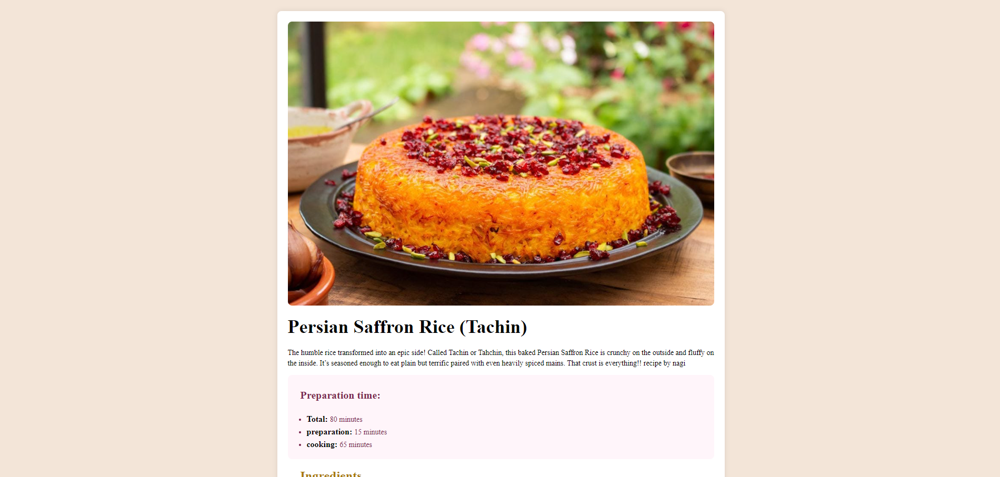

# Frontend Mentor - Recipe page solution

This is a solution to the [Recipe page challenge on Frontend Mentor](https://www.frontendmentor.io/challenges/recipe-page-KiTsR8QQKm).

## Table of contents
  - [Screenshot](#screenshot)
  - [Links](#links)
  - [Built with](#built-with)
- [Author](#author)

## Overview

### Screenshot

### Links
- Live Site URL: [Live Site]( https://mohammadsoleimanikia.github.io/recipe-page/)

### Built with
- Semantic HTML5 markup
- Tailwind
- CSS custom properties
- Flexbox
- Mobile-first workflow

## Author

- Git Hub - [Mohammad Soleimanikia](https://github.com/MohammadSoleimanikia)
- Frontend Mentor - [@MohammadSoleimanikia](https://www.frontendmentor.io/profile/MohammadSoleimanikia)
